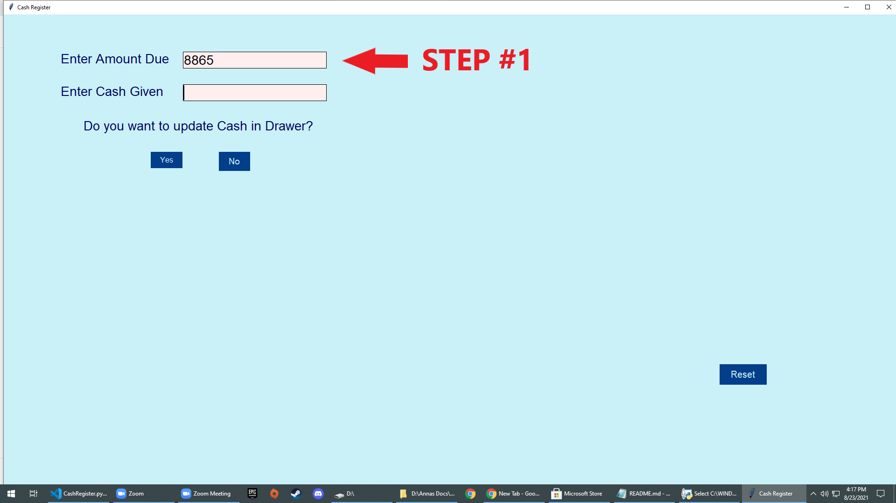
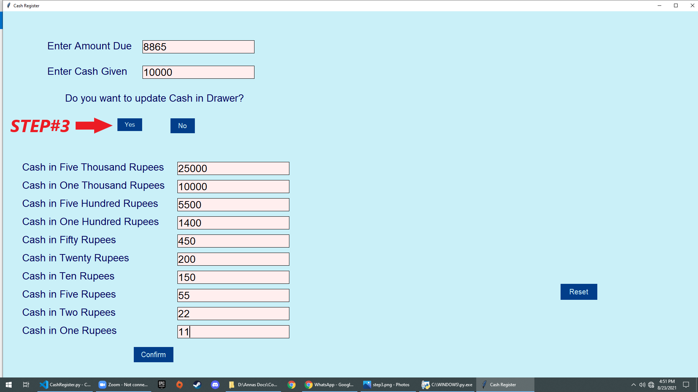
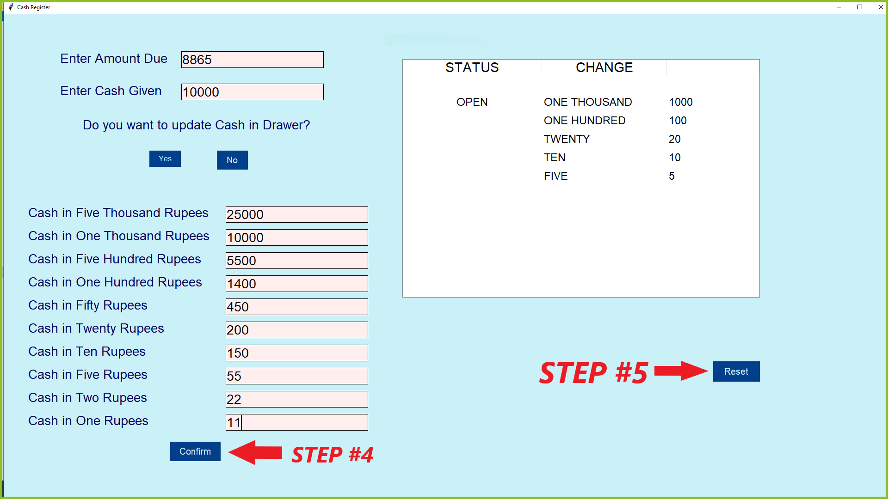
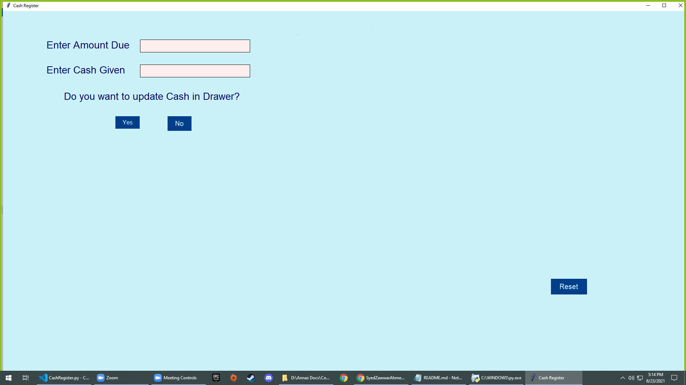

# Cash Register

A Cash Register that accepts purchased price payment and cash in drawer, and displays the change based on the amount due and amount given entered by the user.

## Table of contents

- [Overview](#overview)
  - [Objective](#objective)
  - [Screenshot](#screenshot)
  - [Links](#links)
- [My process](#my-process)
  - [Built with](#built-with)
  - [What I learned](#what-i-learned)
  - [Useful resources](#useful-resources)
- [Author](#author)

## Overview

### Usage

- User can enter the **amount due**, **amount given** and **cash in drawer** using input fields
- User can see the **status key** and **change**
- If cash in drawer is less than the change due or the exact change can not be given then the status key will be **INSUFFICIENT FUNDS** and change key will be empty
- If cash in drawer is equal to the change then the change will be displayed and the status key will be **CLOSED**
- If cash in drawer is greater than change then the change will be displayed and the status key will be **OPEN** 
- User can reset the inputs and results by clicking on the **reset button** but the cash in drawer will not be changed
- User has the option to change the cash in drawer or go with the previous one everytime they calculate a new change
- If User enters an amount which is not the correct multiple of the respective entry (e.g. user enters 16000 instead of 15000 in the Cash in Five thousand rupees field), an error will be thrown to the user and the result will not be displayed.


### Usage Demo








### Links

- Solution URL: [https://github.com/SyedZawwarAhmed/Cash_Register](https://github.com/SyedZawwarAhmed/Cash_Register)

## Our process

### Built with

- Python 
- Python(Tkinter)

### What We learned

While making this project, the most important thing which We learned is Tkinter library. We also learned how to display data in tables using tkinter treeview.

Here is the snippet of the treeview we used in this project
```py
result_tree = ttk.Treeview(root)   
list = result["change"]
result_tree = ttk.Treeview(root, height=12, columns = ("STATUS", "CHANGE", "Change"), show = 'headings') 
result_tree.heading("STATUS", text = "STATUS")
result_tree.heading("CHANGE", text = "CHANGE")
result_tree.column("CHANGE", width = 270)
result_tree.column("STATUS",width = 300, anchor=CENTER)
style = ttk.Style()
style.configure("Treeview", rowheight = 40, background = "Silver", fieldbackground = "Silver")
style.configure("Treeview.Heading", font=('Arial', 22))	
```

### Useful resources

- [Stack Overflow](https://www.stackoverflow.com) - As always, when we got stuck, stackoverflow helped me get through.
- [w3Schools](https://www.w3schools.com) - This is the best website for documentation with easily understandable code examples.

## Authors

- **[Syed Zawwar Ahmed](https://github.com/SyedZawwarAhmed)**
- **[Muhammad Annas Baig](https://github.com/Annas03)**
